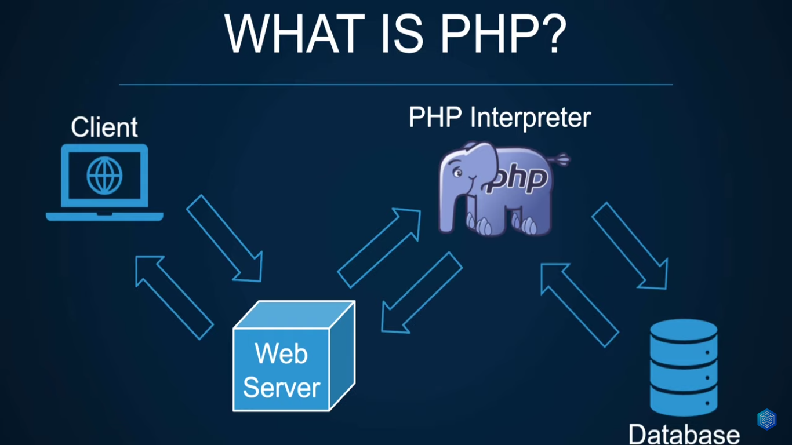

# Learn PHP The Right Way

It mean learning from the begining to advance. Knowing this topic beyond the basics will help you better understand hwo certain work within the framework, helping you build the right foundation. It will also help you write clean, efficient, and secure code and help you deep dive into existing codebases as well understand how they work

## What Is PHP?

`PHP` is `Hyprtext Preprocessor` which is open source scripting language that is mainly used for web development, scripting language are also programming language.

Main different between scripting and programming language lies within their execution:

- programming language need to be compile into machine language
- scripting language need to be enterpreted

Unlike `JavaScript` which runs on the client within the browser `PHP` requires a server to runs.

## Why PHP & What Can You Do With It?

- Easier to get started
- Beginner friendly
    - This is one of the `PHP` streght and also the weeknesses, because of this simplicity you can write prety bad code and it will still run just fine
- Powerful build `CLI` tools
    - `PHP` is very powerful not only you can build very simple website but you can build very complex web application even at enterprise level
- Build websites & web apps
- Great ecosystem & frameworks
    - `PHP` is also has amzing and huge ecosystem and some of the best framework
    - You could build e-commerce web applications, connect coutless other third-party services, build company websites, build CRM system, blogs, billing, invoicing, warehouse management. The possibilities are endless.

## Is PHP dead?

Which is actually `PHP` powers 75% of websites whose server side language now. So no `PHP` is not dead and it's not going dead anytime soon.

Yes `PHP` code can be bad, but again you could write garbage code in any programming language, also `PHP` has evolved a lot since `PHP-4` and `PHP-5`, it's was mostly procedural back then but it has become more OOP and has introduced great support for strict types. A lot of times they've skipped some of the advanced topics, security for exmaple and jumpt straight into buiding a website because as i mentioned before `PHP` is pretty simple

## Course Overview

- Basic `PHP` (Procedural)
    - `PHP` Installation & Setup
    - Syntax & Operators
    - Variables & Data Types
    - Control Structures & Functions
    - Type Casting & Error Handling
    - php.ini / web server configs
    - Working with arrays
    - Working with Dates
    - etc.
- Intermediate `PHP` (OOP)
    - Classes & Methods
    - Object Oriented `PHP`
    - Code Style & PSR
    - Namespaces & Autoloading
    - Dependency Management
    - Super Globals ($\_\*)
    - Cookies & Sessions
    - Databases
    - etc.
- Advance `PHP`
    - Testing, phpUnit, TDD, BDD
    - Intro to MVC & Routing
    - Dependency Injection Container
    - Caching & Security
    - Frameworks
    - `PHP-8`
    - Hosting & Deployment
    - Best practices
    - etc.

> The GOAL of this course is for you to know things in PHP beyond beginer level and procedural `PHP`

## Requirement?

- HTML
